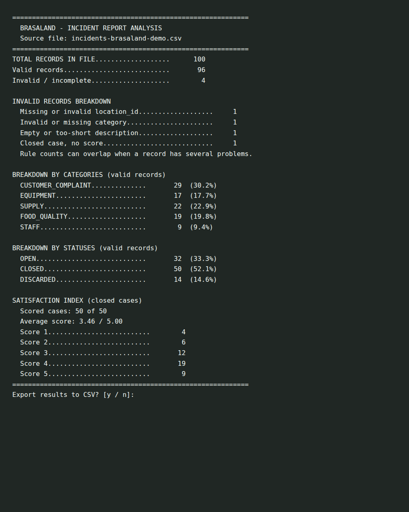
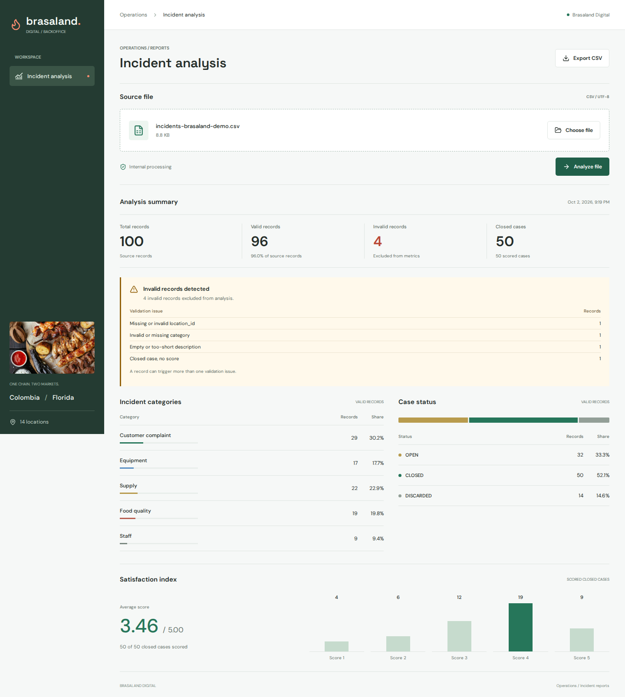
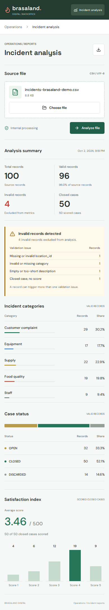

# Incident Analyzer Verification

## Source of Truth

[Context-company.md](../../Context-company.md) supplies the Brasaland schema
and benchmark. Its introduction mentions 1,000 rows, but its distribution,
expected output, and the assignment specify **100 rows**; the explicit 100-row
benchmark is used for tests. CLOSED cases require a score in this context,
unlike the generic assignment's optional-score wording.

The original `incidents-brasaland.csv` attachment was not available during
implementation. **The committed demo CSV and these screenshots use synthetic
data, not the original attachment.** Synthetic records reproduce the published
distributions; they do not independently verify the real course sample.

## Checks Completed

- Ten shared-analyzer/CLI tests, including the complete synthetic benchmark.
- Four API tests for uploads, errors, exports, session isolation, and expiry.
- Four Playwright tests for desktop/mobile workflows, drag/drop and screenshots.
- One million generated records processed with bounded memory (approximately
  13 MiB peak process RSS in this development container).
- Frontend build and production dependency audit passed.

| Metric | Published benchmark | Synthetic test |
| --- | --- | --- |
| Total | 100 | 100 |
| Valid / invalid | 96 / 4 | 96 / 4 |
| CUSTOMER_COMPLAINT / EQUIPMENT / SUPPLY / FOOD_QUALITY / STAFF | 29 / 17 / 22 / 19 / 9 | Exact match |
| OPEN / CLOSED / DISCARDED | 32 / 50 / 14 | Exact match |
| Closed scored cases | 50 | 50 |
| Scores 1 / 2 / 3 / 4 / 5 | 4 / 6 / 12 / 19 / 9 | Exact match |
| Average satisfaction | 3.46 | 3.46 |
| Invalid location / category / description / closed-without-score | 1 / 1 / 1 / 1 | Exact match |

## Screenshots

Synthetic 100-row CLI output:

Desktop backoffice with synthetic analysis:

Mobile backoffice with synthetic analysis:

## Before Submission

Obtain the original course attachment locally (never paste private rows into
AI chat), run `python scripts/analyze.py <local-path-to-course-csv>`, and compare
every metric against the table above. Upload the same file through the browser
and confirm the export. Capture fresh screenshots and clearly identify the
dataset used. Do not commit private incident data or customer details.

Commit the implementation and publish a PR to the original repository once
the course sample has been verified. No branch, commit, push, or PR was created
as part of this implementation session.